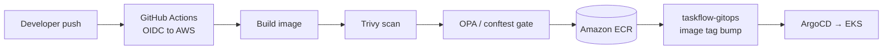

# Architecture

`taskflow-app` is a Node.js/Express service whose job in the platform is narrow and clean: produce a trusted, observable container image. It does not deploy itself — that separation is deliberate.

## Components

- **Express application** — the TaskFlow service logic.
- **OpenTelemetry instrumentation** — traces, metrics, and logs emitted in a single standard, ready for the observability stack to collect.
- **pino logging** — structured JSON logs with `trace_id` and `span_id` injected, so every log line correlates back to its trace.
- **CI pipeline** — GitHub Actions builds, scans, and policy-checks the image, then pushes to Amazon ECR.

## Build and publish flow

## Key decisions

**Keyless authentication via OIDC.** GitHub Actions assumes an AWS role through OIDC rather than storing long-lived access keys. There are no static AWS credentials anywhere in the repo or its secrets.

**Bad images never reach the registry.** Trivy scans for vulnerabilities and OPA/conftest enforces policy before the push step. A failing scan or policy check stops the pipeline, so ECR only ever holds images that passed both gates.

**Observability is built in, not bolted on.** The app ships instrumented. When the observability stack is running, traces, metrics, and correlated logs are available immediately with no code changes.

**The image is the only artifact.** This repo's responsibility ends at a trusted image in ECR. Deploying it is `taskflow-gitops`' job — keeping build concerns and delivery concerns in separate repos.

## Deployment boundaries

| Concern | Decision |
|---------|----------|
| Output | Trusted container image in Amazon ECR |
| Auth | GitHub Actions OIDC — no static keys |
| Gates | Trivy scan + OPA/conftest, both blocking |
| Delivery | Handled downstream by `taskflow-gitops` |
| Region | `us-east-1` |
| Account | `713923090919` |